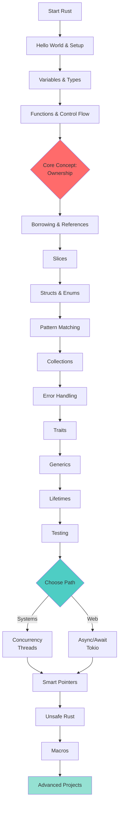
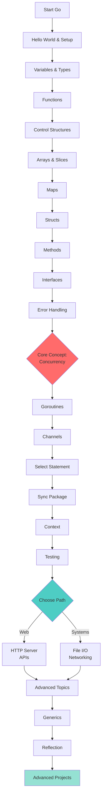
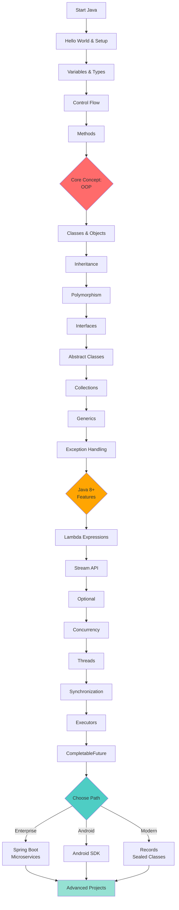
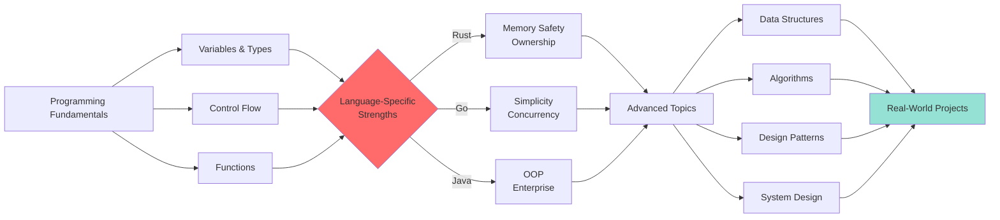
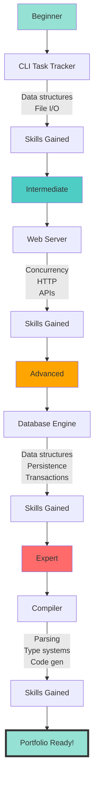
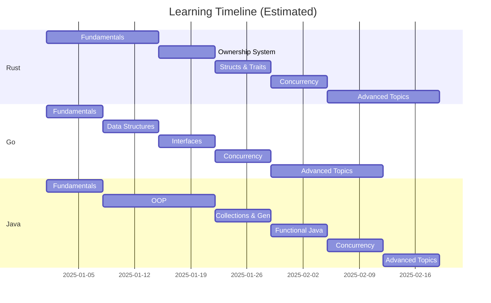

# Learning Roadmap: Rust, Go, and Java

This roadmap visualizes the learning path for each language, showing the progression from fundamentals to advanced topics.

---

## Rust Learning Path



---

## Go Learning Path



---

## Java Learning Path



---

## Cross-Language Concepts



---

## Project Progression



---

## Skill Development Timeline



---

## Difficulty Progression

### Rust
```
Beginner    ████████░░░░░░░░░░░░  40%
Intermediate ████████████░░░░░░░░  60%
Advanced    ████████████████████  100%

Key Challenges:
1. Borrow checker (Week 2-3)
2. Lifetimes (Week 4)
3. Async programming (Week 6)
```

### Go
```
Beginner    ████████████░░░░░░░░  60%
Intermediate ████████████████░░░░  80%
Advanced    ████████████████████  100%

Key Challenges:
1. Understanding interfaces (Week 3)
2. Goroutines & channels (Week 4)
3. Context package (Week 5)
```

### Java
```
Beginner    ██████████░░░░░░░░░░  50%
Intermediate ███████████████░░░░░  75%
Advanced    ████████████████████  100%

Key Challenges:
1. OOP concepts (Week 2-3)
2. Generics & wildcards (Week 4)
3. Concurrency (Week 6-7)
```

---

## Learning Strategies

### For Absolute Beginners

**Recommended Order:** Go → Java → Rust

**Why?**
1. **Go**: Simplest syntax, gentle learning curve
2. **Java**: Introduces OOP concepts gradually
3. **Rust**: Most challenging, but rewarding

### For Experienced Programmers

**Recommended Order:** Rust → Go → Java

**Why?**
1. **Rust**: Teaches modern systems programming
2. **Go**: See a different approach to concurrency
3. **Java**: Understand enterprise patterns

---

## Milestone Checklist

### Phase 1: Foundations (Weeks 1-3)
- [ ] Complete "Hello World" in all three languages
- [ ] Understand basic syntax and control flow
- [ ] Write first program with functions
- [ ] Read and write files

### Phase 2: Core Concepts (Weeks 4-6)
- [ ] Master language-specific features:
  - Rust: Ownership and borrowing
  - Go: Goroutines and channels
  - Java: Classes and inheritance
- [ ] Complete Task Tracker project
- [ ] Write unit tests

### Phase 3: Intermediate (Weeks 7-10)
- [ ] Understand error handling patterns
- [ ] Work with collections
- [ ] Complete Web Server project
- [ ] Learn debugging tools

### Phase 4: Advanced (Weeks 11-15)
- [ ] Master concurrency in each language
- [ ] Complete Database project
- [ ] Optimize for performance
- [ ] Learn profiling tools

### Phase 5: Expert (Weeks 16-20)
- [ ] Understand advanced type systems
- [ ] Complete Compiler project
- [ ] Contribute to open source
- [ ] Build portfolio projects

---

## Resource Recommendations

### Books
- **Rust**: The Rust Programming Language (The Book)
- **Go**: The Go Programming Language (Donovan & Kernighan)
- **Java**: Effective Java (Joshua Bloch)

### Practice Platforms
- **Exercism**: Language-specific exercises
- **LeetCode**: Algorithm practice
- **Advent of Code**: Annual coding challenges
- **Project Euler**: Mathematical problems

### Communities
- **Rust**: r/rust, Rust Users Forum
- **Go**: r/golang, Go Forum
- **Java**: r/java, Stack Overflow

---

## Time Investment

| Level | Rust | Go | Java | Total (Sequential) | Total (Parallel) |
|-------|------|-----|------|-------------------|------------------|
| **Basic Proficiency** | 40h | 30h | 50h | 120h | 50h |
| **Job Ready** | 120h | 100h | 130h | 350h | 150h |
| **Expert** | 300h+ | 250h+ | 300h+ | 850h+ | 350h+ |

**Note:** Parallel learning = studying all three simultaneously (concepts transfer)

---

## Next Steps

1. **Choose your starting language** based on your goals
2. **Set up development environment** (see GETTING_STARTED.md)
3. **Complete first lesson** (Hello World)
4. **Join community** (Discord, Reddit, Forums)
5. **Code every day** (consistency > intensity)

---

## Progress Tracking

Use the `progress.json` files in each language directory to track your learning:

```bash
# View your progress
cat rust/progress.json | jq '.statistics'
cat go/progress.json | jq '.statistics'
cat java/progress.json | jq '.statistics'
```

---

**Ready to start?** Choose your language:
- [Rust Learning Path](./rust/README.md)
- [Go Learning Path](./go/README.md)
- [Java Learning Path](./java/README.md)
